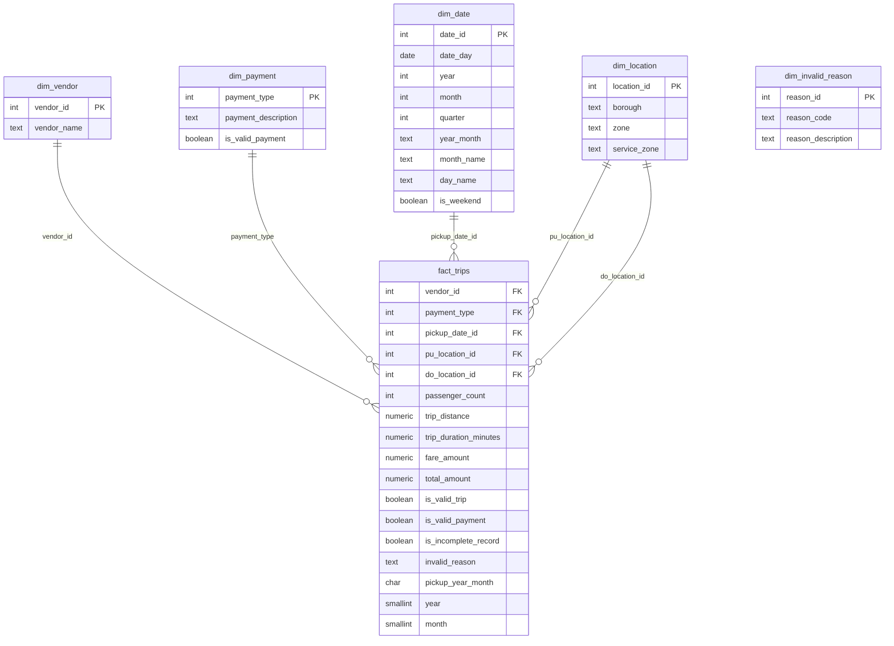

# NYC Yellow Taxi — Pipeline de Dados (Arquitetura Medalhão)

Pipeline de dados que ingere, trata e modela as corridas de táxi amarelo da cidade de Nova York (NYC TLC), seguindo a arquitetura medalhão (bronze, silver e gold). O projeto baixa os arquivos públicos de corridas, consolida e aplica regras de qualidade, e disponibiliza uma modelagem dimensional pronta para análise, tudo orquestrado por Airflow e reproduzível com um único comando.

Construí este projeto como parte de um processo seletivo para a vaga de Engenheiro de Dados.

---

## Sumário

- [Visão geral](#visão-geral)
- [Stack e por que usei cada ferramenta](#stack-e-por-que-usei-cada-ferramenta)
- [Arquitetura](#arquitetura)
- [Estrutura do projeto](#estrutura-do-projeto)
- [Como executar](#como-executar)
- [As camadas em detalhe](#as-camadas-em-detalhe)
- [Regras de qualidade](#regras-de-qualidade)
- [Descobertas sobre os dados](#descobertas-sobre-os-dados)
- [Modelagem dimensional](#modelagem-dimensional)
- [Orquestração](#orquestração)
- [Testes](#testes)
- [Decisões de projeto e limitações conhecidas](#decisões-de-projeto-e-limitações-conhecidas)
- [Evoluções possíveis](#evoluções-possíveis)

---

## Visão geral

A empresa fictícia Urban Mobility Analytics precisa analisar corridas de táxi a partir de uma base pública. Para isso, eu construí um pipeline que:

1. Baixa os arquivos Parquet de Yellow Taxi da NYC TLC com um módulo Python, uma competência mensal por vez, de forma incremental.
2. Armazena os dados brutos na camada bronze, tanto no data lake (arquivos Parquet) quanto no PostgreSQL, usando Python para a carga.
3. Consolida, trata e aplica regras de qualidade na camada silver, usando PySpark, gravando o resultado no PostgreSQL.
4. Modela os dados em fatos e dimensões na camada gold, dentro do PostgreSQL, usando dbt.
5. Disponibiliza uma materialized view no PostgreSQL com os indicadores de negócio, também usando dbt.
6. Orquestra todo o fluxo com Airflow.

As três camadas da arquitetura vivem em schemas separados dentro do PostgreSQL (bronze, silver e gold), e todo o ambiente roda em contêineres Docker, o que torna o projeto reproduzível em qualquer máquina.

Trabalhei com os seis primeiros meses de 2025, totalizando cerca de 24 milhões de corridas.

---

## Stack e por que usei cada ferramenta

O desafio pedia que eu justificasse o uso de cada ferramenta. Minha lógica foi escolher a ferramenta certa para cada responsabilidade, e não usar tudo em todo lugar.

**Python** — usei para a ingestão: baixar os arquivos e carregar os dados brutos no banco. São tarefas de coordenação e movimentação de arquivos que não exigem processamento distribuído, então Python puro com bibliotecas maduras (requests, pyarrow, SQLAlchemy) foi a escolha mais simples e direta.

**PySpark** — usei na transformação da bronze para a silver. Aqui o volume justifica o uso do PySpark: são milhões de linhas por competência, lidas de arquivos Parquet. O Spark lê Parquet de forma paralela e eficiente, e a API de DataFrame expressa bem as regras de qualidade. Rodei o Spark em modo local (local mode), o que explico na seção de decisões.

**PostgreSQL** — é o data warehouse do projeto, onde vivem as três camadas em schemas separados (bronze, silver, gold). É um banco relacional robusto, com suporte nativo a materialized views e ótima integração com dbt. Toda a modelagem analítica e os indicadores finais são materializados nele.

**dbt** — usei na transformação da silver para a gold. O dbt é a ferramenta certa para modelagem analítica em SQL: ele gerencia dependências entre modelos (lineage), materializa tabelas e views, e traz testes de dados declarativos. Toda a construção de fatos, dimensões e da materialized view é feita em dbt.

**Airflow** — orquestra o pipeline inteiro. Ele decide o que roda, em que ordem, com retry automático, e deriva a competência a ser processada da própria data de execução, o que torna o backfill possível. O Airflow não processa dado, ele coordena as etapas que processam.

**Docker** — todo o ambiente (Airflow, os dois bancos PostgreSQL, o Spark e o dbt) roda em contêineres orquestrados por Docker Compose. Usei Docker para garantir reprodutibilidade: permite o repositório ser clonado e subir o projeto com poucos comandos, sem precisar instalar nada na máquina além do próprio Docker. É também o que garante que todos rodem exatamente as mesmas versões de cada componente.

---

## Arquitetura

O fluxo de dados segue a arquitetura medalhão:

```
NYC TLC (Parquet público)
        │
        ▼
  [ download ]  Python
        │
        ▼
  BRONZE (lake)                 parquets crus, imutáveis, particionados por competência
        │
        ▼
  [ load_bronze ]  Python + COPY
        │
        ▼
  BRONZE (PostgreSQL)           cópia consultável dos dados brutos + criação da tabela payment_type
        │
        ▼
  [ job silver ]  PySpark       regras de qualidade + enriquecimento
        │
        ▼
  SILVER (PostgreSQL)           corridas tratadas, anomalias sinalizadas
        │
        ▼
  [ dbt ]  silver → gold
        │
        ▼
  GOLD (PostgreSQL)             fatos, dimensões e materialized view de indicadores
```

Uma distinção importante: a camada bronze existe em dois lugares. No **data lake** (em disco), guardo os arquivos Parquet crus, um por competência, exatamente como vieram da origem. No **PostgreSQL**, mantenho uma cópia consultável desses mesmos dados. A imutabilidade real do dado bruto mora no lake; a tabela do banco é uma camada de conveniência para consulta.

---

## Estrutura do projeto

```
.
├── docker/                  # imagem customizada do Airflow (PySpark, Java, dbt)
├── dags/                    # DAG do Airflow
├── src/
│   ├── ingestion/           # download e carga da bronze
│   ├── transform/           # job PySpark bronze → silver
│   └── common/              # configuração central
├── sql/ddl/                 # DDL das camadas e tabelas de referência
├── dbt/
│   ├── models/gold/         # fatos, dimensões e materialized view
│   ├── models/staging/      # declaração das fontes (sources)
│   └── macros/              # macro de schema
├── tests/                   # testes de código (pytest)
├── data/                    # data lake local (bronze), fora do versionamento
├── docker-compose.yaml
├── requirements.txt         # dependências de execução
├── requirements-dev.txt     # dependências de desenvolvimento (testes)
└── README.md
```

Optei pelo dbt como projeto separado na raiz porque ele espera uma raiz própria, e isso deixa a fronteira entre as etapas explícita: a ingestão e a transformação bronze/silver são Python e PySpark, enquanto a transformação silver/gold é dbt e SQL.

---

## Como executar

Todo o projeto roda em contêineres Docker. Não é preciso instalar Python, Spark, dbt ou PostgreSQL na máquina: cada uma dessas ferramentas vive dentro de um contêiner. O único pré-requisito é ter o Docker funcionando.

### Pré-requisitos

- **Docker e Docker Compose.** É o único software que precisa estar instalado na máquina. A forma mais simples de obter os dois é instalar o [Docker Desktop](https://www.docker.com/products/docker-desktop/), que já inclui o Docker Compose. No Windows, o Docker Desktop roda sobre o WSL2 e o configura durante a instalação; em Linux e macOS, roda de forma nativa.
- **Cerca de 8 GB de memória** disponíveis para os contêineres, já que o Airflow e o Spark rodam ao mesmo tempo.

Todos os comandos abaixo são executados em um terminal, a partir da pasta raiz do projeto (a pasta criada ao clonar o repositório).

### Passo 1 — Clonar o repositório

```
git clone <url-do-repositorio>
cd nyc-taxi-pipeline
```

### Passo 2 — Configurar as variáveis de ambiente

O projeto lê credenciais e configurações de um arquivo `.env`, que não é versionado. Crie o seu a partir do modelo fornecido:

```
cp .env.example .env
```

O arquivo já vem com valores padrão de desenvolvimento que funcionam. Em **Linux ou WSL2**, ajuste a variável `AIRFLOW_UID` para o id do seu usuário, de modo que os arquivos criados pelos contêineres (como os logs do Airflow) tenham o dono correto no seu sistema:

```
sed -i "s/^AIRFLOW_UID=.*/AIRFLOW_UID=$(id -u)/" .env
```

Em macOS ou Windows sem WSL, o valor padrão já funciona e este passo pode ser ignorado.

### Passo 3 — Construir as imagens

```
docker compose build
```

Este passo constrói a imagem customizada do Airflow, que inclui o Java, o PySpark, o driver de conexão com o PostgreSQL e o dbt em ambiente isolado. Na primeira execução, o download das dependências leva alguns minutos. Ao final, as imagens devem aparecer como `Built`.

### Passo 4 — Inicializar o Airflow

```
docker compose up airflow-init
```

Prepara o banco de metadados do Airflow e cria o usuário de acesso. Roda uma vez e encerra sozinho; ao final, deve exibir o código de saída zero (`exited with code 0`).

### Passo 5 — Subir o ambiente

```
docker compose up -d
```

Sobe todos os serviços em segundo plano: o Airflow (scheduler, webserver e triggerer), o banco de metadados e o banco do data warehouse. Na primeira inicialização do banco do warehouse, os scripts em `sql/ddl/` são executados automaticamente, criando os schemas das três camadas e as tabelas de referência, sem nenhum passo manual.

Confirme que os serviços subiram:

```
docker compose ps
```

Todos devem aparecer como `healthy` ou `running`. Para confirmar que os schemas foram criados:

```
docker compose exec postgres-dw psql -U taxi -d nyc_taxi -c "\dn"
```

Devem aparecer os schemas `bronze`, `silver` e `gold`.

### Passo 6 — Executar o pipeline

Acesse a interface do Airflow em `http://localhost:8080`, com usuário e senha `airflow`.

A DAG `nyc_taxi_pipeline` processa uma competência mensal por execução, derivando o mês da data de execução. Para processar uma competência específica de ponta a ponta pela linha de comando:

```
docker compose exec airflow-scheduler airflow dags test nyc_taxi_pipeline 2025-06-15
```

O comando acima processa a competência de junho de 2025: baixa o arquivo Parquet, carrega na bronze, gera a silver com as regras de qualidade e atualiza a gold. O processamento leva alguns minutos, já que envolve a leitura de milhões de linhas no Spark.

### Inspecionar os resultados

O banco do data warehouse fica acessível em `localhost:5433` (usuário `taxi`, banco `nyc_taxi`, senha definida no `.env`) por qualquer cliente PostgreSQL, como o DBeaver. Os indicadores finais ficam na materialized view `gold.mv_trip_indicators`.

### Encerrar o ambiente

Para parar os contêineres, mantendo os dados:

```
docker compose down
```

Para parar e apagar também os volumes (recomeçar do zero, com os bancos vazios):

```
docker compose down -v
```

### Nota sobre reprodutibilidade

Fixei as versões de todas as imagens e dependências (PostgreSQL 16, Airflow 2.10.5, e assim por diante) para garantir que qualquer pessoa que rode o projeto obtenha exatamente o mesmo resultado. Validei o processo completo a partir de um clone limpo do repositório, seguindo exatamente estes passos.

---

## As camadas em detalhe

### Bronze

A bronze é a cópia fiel da origem. Não transformo nenhum valor nela; os tipos espelham exatamente o que vem do Parquet. Mantive os nomes das colunas em minúsculas para evitar identificadores com aspas no PostgreSQL, mas sem renomear nada além disso, preservando a rastreabilidade com o arquivo de origem.

Cada linha carrega colunas de controle (competência, arquivo de origem, data de ingestão) que permitem reconstruir qualquer arquivo original e dão rastreabilidade de linhagem.

A carga da bronze é idempotente: antes de inserir uma competência, apago as linhas daquela competência e recarrego, tudo na mesma transação. Uso `COPY` em vez de `INSERT` porque, com milhões de linhas por competência, isso otimiza o carregamento dos dados.

### Silver

A silver é onde os dados são consolidados e tratados. O job PySpark lê os Parquet crus do lake, aplica as regras de qualidade, enriquece com a descrição do tipo de pagamento e escreve o resultado no PostgreSQL.

Um princípio guiou toda a silver: **nenhuma linha é descartada**. As anomalias são sinalizadas conforme solicitado no desafio, não removidas. Decidir o que fazer com uma corrida suspeita será responsabilidade de quem consome os dados, não da camada de tratamento. Para isso, cada corrida recebe uma flag de validade e, quando aplicável, o motivo (ou motivos) da anomalia.

Também apliquei tratamentos de limpeza: padronizei o campo de texto para maiúsculas e criei uma flag de registro incompleto para corridas sem contagem de passageiros. Avaliei aplicar padronização de texto, mas o dataset não tem texto livre: as localizações são códigos numéricos de zona, então não havia inconsistência textual a resolver.

### Gold

A gold é a camada de negócio, modelada em star schema com o dbt. É aqui que aplico a normalização dos dados: os códigos crus deixam de carregar seus atributos descritivos e passam a ser chaves para as dimensões.

A fato guarda apenas chaves e medidas, mantendo-se enxuta apesar dos 24 milhões de linhas, enquanto os atributos descritivos migram para as tabelas de dimensão. Vale notar que o star schema é deliberadamente um meio-termo: a separação entre fato e dimensões normaliza o modelo, mas cada dimensão é mantida desnormalizada para favorecer a leitura analítica, evitando joins excessivos em tempo de consulta.

O detalhamento da modelagem dimensional, com as dimensões, a fato, os relacionamentos e as decisões de grão e chave, está na seção [Modelagem dimensional](#modelagem-dimensional), mais adiante neste documento.

---

## Regras de qualidade

O desafio pedia de três a seis regras. Implementei seis, sendo duas exigidas e quatro que adicionei após analisar os dados:

1. Duração acima de 6 horas 
2. Distância acima de 100 milhas 
3. Duração menor ou igual a zero 
4. Distância menor ou igual a zero
5. Valor total negativo 
6. Embarque fora da competência **(registro temporalmente corrompido)**

A última regra tem uma sutileza importante. Os arquivos da TLC contêm corridas cuja data de embarque não bate com o mês do arquivo. A maioria é apenas transbordo de virada de mês (uma corrida que começou às 23h40 do dia 31 e caiu no arquivo do mês seguinte), o que é perfeitamente normal. Mas há também lixo temporal real: corridas com data de embarque em 2007 ou 2009 dentro de arquivos de 2025. Para separar os dois casos, apliquei uma tolerância de um dia: o transbordo de virada é aceito, o lixo temporal é sinalizado.

Cada corrida pode violar mais de uma regra ao mesmo tempo, então o motivo da invalidez guarda todos os motivos aplicáveis, não apenas o primeiro. Isso permite medir a incidência real de cada regra.

---

## Descobertas sobre os dados

Analisar os dados antes de modelá-los revelou coisas que mudaram decisões do projeto. Documento aqui as principais ao longo da construção, porque elas mostram o raciocínio por trás das escolhas.

**As regras que o desafio pediu capturam pouco do problema real.** As duas regras exigidas (duração e distância excessivas) sinalizam menos de 1% das corridas com problema. As quatro que adicionei capturam mais de 99%. A maior parte das anomalias são corridas com distância zerada ou valor negativo.

**Existe um tipo de pagamento fora do dicionário fornecido.** O desafio forneceu uma tabela de tipos de pagamento com os códigos de 1 a 6. Mas cerca de 22,5% das corridas têm o código 0, que não está nessa tabela. Ao consultar o dicionário oficial da TLC de 2025, descobri que o código 0 corresponde a "Flex Fare trip", um produto de corrida por aplicativo. Mantive a tabela de referência fiel exatamente ao que o desafio pediu (apenas códigos de 1 a 6) e tratei o código 0 na fato como um valor conhecido mas não classificado, preservando o dado em vez de descartá-lo. Referência: [`Dicionário Oficial da NYC TLC para Yellow Taxi`](https://www.nyc.gov/assets/tlc/downloads/pdf/data_dictionary_trip_records_yellow.pdf).

**Dois problemas de dado que pareciam iguais eram distintos.** Investigando as corridas sem contagem de passageiros, descobri que os valores nulos estão 100% dentro do segmento de código de pagamento 0 (o Flex Fare), enquanto os valores zero estão 100% fora dele. São dois fenômenos com causas diferentes: o nulo é característica do fluxo de corridas por app, e o zero é falha de registro em corrida comum.

**A taxa de anomalias cresce ao longo do ano.** A proporção de corridas sinalizadas sobe de cerca de 4,4% em janeiro para 6,7% em maio. A hipótese que levanto é a introdução da taxa de congestionamento de Manhattan em 2025, que aparece como uma coluna nova nos dados e provavelmente gera mais lançamentos de ajuste e estorno.

---

## Modelagem dimensional

A camada gold segue um esquema estrela, com uma tabela fato central e dimensões ao redor.




O diagrama mostra a fato `fact_trips` no centro, ligada às dimensões pelas chaves estrangeiras. A `dim_location` aparece ligada duas vezes à fato, uma para o local de embarque e outra para o de desembarque, a depender da necessidade analítica. A `dim_invalid_reason` aparece sem ligação direta com a fato porque o motivo da invalidez é hoje um campo de texto na fato; ela funciona como catálogo de referência dos motivos, e a ligação formal muitos-para-muitos seria feita por uma tabela ponte, descrita na seção de evoluções.


**Fato:** 

- `fact_trips`, com grão de uma linha por corrida. Guarda as chaves estrangeiras para as dimensões e as métricas numéricas (valores, distância, duração). Carrega de forma incremental por competência, o que responde ao requisito de atualização incremental do desafio: reprocessar uma competência substitui apenas as linhas dela, sem reconstruir os 24 milhões de registros.

**Dimensões:**

- `dim_payment` — tipos de pagamento, fiel à tabela passada no desafio.
- `dim_vendor` — fornecedores de tecnologia, com os nomes oficiais do dicionário da TLC (a mesma fonte que o desafio indicou para os pagamentos).
- `dim_date` — calendário de 2020 a 2030, com atributos temporais pré-calculados. Gerei um intervalo amplo e fixo para que qualquer competência processada encontre suas datas, sustentando a atualização incremental.
- `dim_location` — zonas de táxi da cidade, que enriquecem os códigos de origem e destino com bairro e zona de serviço. Esta dimensão participa da fato em dois papéis (embarque e desembarque), apontando ambos para a mesma tabela.
- `dim_invalid_reason` — catálogo dos motivos de invalidez.

**Materialized view:** `mv_trip_indicators`, com os indicadores pedidos no desafio (total de corridas, valor das corridas válidas, ticket médio e distância média), agrupados por fornecedor e competência. O total de corridas considera todas as viagens, porque o volume operacional inclui as anomalias (a corrida aconteceu); já os indicadores de valor e distância consideram apenas as corridas válidas, para não serem distorcidos por estornos e anomalias.

---

## Orquestração

A DAG do Airflow (`nyc_taxi_pipeline`) executa o pipeline em quatro etapas encadeadas: baixar, carregar na bronze, processar a silver e processar a gold. O desafio menciona três etapas, mas explicito a carga da bronze como uma etapa própria, porque ela é um passo real do fluxo.

A competência a ser processada vem da data lógica do Airflow, nunca da data atual do sistema. Essa escolha é o que torna o backfill possível e as tarefas reexecutáveis: cada execução sabe exatamente qual competência representa, independentemente de quando roda.

O agendamento é semanal, conforme o desafio pediu. Há uma tensão consciente aqui: os dados da TLC são publicados mensalmente, então um agendamento semanal reprocessa a mesma competência várias vezes. Como cada camada é idempotente, esse reprocessamento não corrompe o resultado, apenas repete trabalho. Numa evolução, eu usaria um trigger para processar somente quando um novo arquivo estivesse disponível.

---

## Testes

O projeto separa testes de dado de testes de código, porque são coisas diferentes.

**Testes de dado (dbt):** validam propriedades das tabelas materializadas, como unicidade e não-nulidade das chaves de dimensão, e a restrição de que os tipos de pagamento sejam exatamente os do desafio. Rodam sobre o dado real, no banco.

**Testes de código (pytest):** validam a lógica das regras de qualidade, exercitando-as com dados de exemplo através de uma sessão Spark, exatamente como rodam em produção. Um deles prova as duas faces da regra de competência de uma vez: o lixo temporal é sinalizado, e o transbordo de virada de mês é aceito.

Optei por deixar a verificação de duplicidade como um teste, em vez de aplicar uma remoção de duplicatas no pipeline. Medi o dado e não há duplicatas na chave de negócio; adicionar uma remoção que nunca remove nada só custaria desempenho a cada execução. O teste garante essa propriedade e avisa caso ela deixe de valer.

---

## Decisões de projeto e limitações conhecidas

Documento aqui, de forma transparente, decisões que tomei conscientemente e onde eu faria diferente em um cenário de produção.

**Bronze no PostgreSQL não é append-only.** A imutabilidade real do dado bruto mora no lake, onde os arquivos Parquet nunca são tocados após o download. A tabela do banco prioriza idempotência sobre imutabilidade. Numa arquitetura de produção auditável, eu versionaria as cargas.

**Spark em modo local.** Rodei o Spark em modo local, dentro do worker do Airflow, em vez de um cluster dedicado. Como todo o processamento acontece em uma única máquina, um cluster containerizado apenas simularia a topologia distribuída sem trazer ganho real. Escrevi o job de forma portável (usando apenas a API de DataFrame e recebendo caminhos por parâmetro), de modo que migrar para um cluster real seria trocar o modo de execução, sem alterar a lógica.

**dbt em ambiente isolado.** O dbt e o Airflow têm dependências que conflitam entre si. Para rodar os dois na mesma imagem, instalei o dbt em um ambiente Python isolado, separando os dois universos.

**Criação de schema via inicialização do banco.** Os schemas e tabelas de referência são criados automaticamente na primeira inicialização do PostgreSQL. Isso resolve bem a instalação do zero, mas não cobre evolução de schema: uma mudança de estrutura exige recriar o banco. A ferramenta correta para evolução seria uma solução de migração versionada como Flyway ou Alembic, que deixei fora do escopo pelo prazo.

**Integridade referencial parcial em pagamento.** Como preservei o código de pagamento 0 (Flex Fare) na fato, e ele não está na dimensão de pagamento (que é fiel ao desafio), não há integridade referencial completa nesse relacionamento. Foi uma escolha consciente de preservar o dado real em vez de forçar uma dimensão que contradiria o desafio.

**Atomicidade parcial na escrita da silver.** A remoção da competência anterior e a escrita da nova, na silver, não acontecem na mesma transação, porque o escritor do Spark gerencia as próprias transações. Uma falha no meio da escrita deixaria a competência parcial; como a carga é idempotente, uma reexecução corrige o estado.

---

## Evoluções possíveis

Ideias que ficaram fora do escopo por prazo, mas que seriam os próximos passos naturais:

- **Bridge de motivos de invalidez.** O motivo da invalidez é hoje uma lista de valores em um campo de texto. A dimensão de motivos existe como catálogo; a evolução seria uma tabela ponte que normaliza o relacionamento muitos-para-muitos entre corrida e motivos, permitindo análises limpas de incidência por regra.
- **Ingestão orientada a evento.** Substituir o agendamento por tempo por um gatilho que dispara quando um novo arquivo é publicado pela TLC.
- **Migração de schema versionada.** Adotar uma ferramenta de migração para evoluir a estrutura do banco sem recriá-lo.
- **Cluster Spark real.** Caso o volume cresça a ponto de justificar processamento distribuído de verdade.